# Database Design Review: Phase 1.5

This document details the unified V2 PostgreSQL database design on Supabase. It includes table mappings, relationship definitions, index optimizations, RLS security policies, and an Entity-Relationship (ER) diagram.

---

## 1. Entity-Relationship (ER) Diagram

```mermaid
erDiagram
    PROFILES {
        text id PK "Clerk User ID"
        text email "Unique"
        user_role role "SUPER_ADMIN | ADMIN | TRANSACTION_MANAGER | CONTENT_MANAGER | USER"
        timestamp created_at
    }

    PRODUCTS {
        uuid id PK
        text title
        numeric price
        text category "Budget | Mid Range | Premium | Ultra Premium"
        text status "available | sold"
        text primary_login
        text secondary_login
        text unlink_guarantee
        text tag
        text_array image_urls
    }

    REVIEWS {
        uuid id PK
        text name
        text comment
        integer rating
        text status "pending | approved | rejected"
        timestamp created_at
    }

    PROOFS {
        uuid id PK
        text title
        text image_url
        text month
        text year
    }

    ADMIN_PAYMENT_SETTINGS {
        integer id PK "Locked to 1"
        text payee_name
        text payee_upi_id
        text bank_name
        text account_number
        text ifsc_code
    }

    PAYMENT_LINKS {
        uuid id PK
        text access_token "Unique Index"
        text transaction_id
        text customer_name
        numeric amount
        text status "active | paid | revoked | expired"
        integer failed_attempts
        timestamp expires_at
        text pin
        jsonb bank_details
    }

    TRANSACTIONS {
        uuid id PK
        text transaction_id UK "e.g. MBSA403"
        text buyer_name
        text buyer_phone
        numeric total_amount
        text mode_of_deal "WhatsApp | Telegram | F2F | Middleman"
        date deal_date
    }

    ACCOUNT_TRANSACTIONS {
        uuid id PK
        text transaction_ref FK "links to transactions.transaction_id"
        uuid product_id FK "links to products.id"
        numeric owner_price
        numeric sold_price
        numeric profit
        text logins
        text credentials
        text owner_phone
        text seller_phone
        text reseller_phone
    }

    XSUIT_TRANSACTIONS {
        uuid id PK
        text transaction_ref FK
        text xsuit_name
        numeric price
    }

    SUPERCAR_TRANSACTIONS {
        uuid id PK
        text transaction_ref FK
        text car_name
        numeric price
    }

    UC_TRANSACTIONS {
        uuid id PK
        text transaction_ref FK
        integer uc_amount
        numeric price
    }

    TRANSACTIONS ||--o{ ACCOUNT_TRANSACTIONS : "includes"
    TRANSACTIONS ||--o{ XSUIT_TRANSACTIONS : "includes"
    TRANSACTIONS ||--o{ SUPERCAR_TRANSACTIONS : "includes"
    TRANSACTIONS ||--o{ UC_TRANSACTIONS : "includes"
    PRODUCTS ||--o{ ACCOUNT_TRANSACTIONS : "references"
```

---

## 2. Table Schemas & Relationships

### Core Catalog tables
1. **`products`**: BGMI account catalog. Includes primary/secondary login strings, unlink guarantee tags, and Cloudinary screenshot URLs.
2. **`uc_prices`**: Volume-based UC sourcing packs. Uses `method` column (`view_login` vs `character_id`) to switch storefront sections.
3. **`xsuit_gifts`** & **`supercar_gifts`**: Sourced catalogs linking directly to messaging supports.

### Transactional Logs Tables
1. **`transactions`**: The master transaction record (replaces Google Sheets). Connects sequential ID numbers (e.g. `MBSA403`).
2. **`account_transactions`**: Account detail lines containing internal parameters (profit calculations, seller details, reseller phone, owner logins).
3. **`xsuit_transactions`**, **`supercar_transactions`**, **`uc_transactions`**: Custom order logs referencing back to `transactions`.

---

## 3. Database Indexes for Query Performance

To maintain rapid loading times on filters and dashboards, the following database indexes are configured:

| Target Table | Column(s) | Index Type | Optimization Target |
| :--- | :--- | :--- | :--- |
| `products` | `status`, `category` | B-Tree | Filtering active stock in the Ready Stocks catalog. |
| `products` | `title`, `description` | GIN (Full-Text) | PostgreSQL Full-Text Search inside the marketplace. |
| `payment_links` | `access_token` | B-Tree (Unique) | Looking up checkouts when rendering `/pay/[paymentId]`. |
| `transactions` | `transaction_id` | B-Tree (Unique) | Parent lookup joins on detailed transaction lines. |
| `account_transactions`| `transaction_ref` | B-Tree | Cascade delete handling and joins from the transaction lists. |

---

## 4. Row-Level Security (RLS) Policy Matrix

Supabase enforces the following RLS policies checking Clerk role claims (`SUPER_ADMIN`, `ADMIN`, `TRANSACTION_MANAGER`, `CONTENT_MANAGER`):

| Table Name | SELECT Access | INSERT Access | UPDATE / DELETE Access |
| :--- | :--- | :--- | :--- |
| `profiles` | Authenticated users (Self) | System Clerk Webhook | `SUPER_ADMIN` |
| `products` | Public (All) | `SUPER_ADMIN`, `ADMIN` | `SUPER_ADMIN`, `ADMIN` |
| `uc_prices` | Public (All) | `SUPER_ADMIN`, `ADMIN` | `SUPER_ADMIN`, `ADMIN` |
| `xsuit_gifts` | Public (All) | `SUPER_ADMIN`, `ADMIN` | `SUPER_ADMIN`, `ADMIN` |
| `supercar_gifts`| Public (All) | `SUPER_ADMIN`, `ADMIN` | `SUPER_ADMIN`, `ADMIN` |
| `reviews` | Public (Approved reviews) | Public (Forced to `pending`) | `SUPER_ADMIN`, `ADMIN` |
| `proofs` | Public (All) | `SUPER_ADMIN`, `CONTENT_MANAGER`| `SUPER_ADMIN`, `CONTENT_MANAGER`|
| `feedback` | Gated to Admin Roles | Public (Forced to `unread`) | `SUPER_ADMIN`, `ADMIN` |
| `payment_links` | Public (Active checkouts) | `SUPER_ADMIN`, `TRANSACTION_MANAGER` | `SUPER_ADMIN`, `TRANSACTION_MANAGER` |
| `transactions` | Gated to Admin Roles | `SUPER_ADMIN`, `TRANSACTION_MANAGER` | `SUPER_ADMIN`, `TRANSACTION_MANAGER` |
| `*__transactions`| Gated to Admin Roles | `SUPER_ADMIN`, `TRANSACTION_MANAGER` | `SUPER_ADMIN`, `TRANSACTION_MANAGER` |
