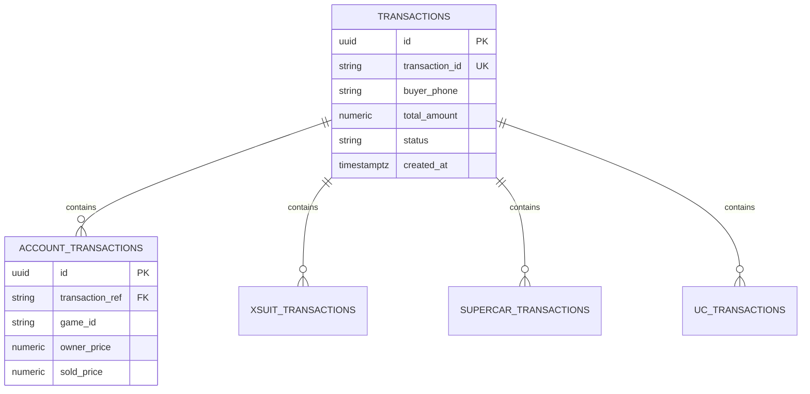

# Database Mapping: V1 Data Sources to V2 Supabase Tables

This document maps all V1 data entities (Firebase Firestore, Supabase, Google Sheets) to unified **V2 Supabase PostgreSQL** tables.

---

## 1. Firebase Collections Migration

| V1 Firebase Collection | V2 Supabase Table | Purpose | Column Transformations |
| :--- | :--- | :--- | :--- |
| `admins` | `profiles` | User profiles with RBAC roles. | `uid` -> `id` (clerk id) `email` -> `email` (text) `role` -> `role` (enum: SUPER_ADMIN, etc.) `createdAt` -> `created_at` (timestamptz) |
| `payment_settings` | `admin_payment_settings` | Global UPI / Bank configurations. | Consolidated into a single table with primary key `id = 1` for unified admin edits. |
| `payment_links` | `payment_links` | Secure generated checkout PIN links. | Relocated from Firebase to Supabase. Adds columns for `failed_attempts` (integer), `revoked_at` (timestamptz), and `revoked_reason` (text). |

---

## 2. Google Sheets Migration

V1 wrote transactions and customer summaries directly to separate worksheets in Google Sheets. V2 unifies them into PostgreSQL tables with foreign key relations, while keeping Google Sheets as an optional async export.

### Sheet: `transactions` → Table: `transactions`
Main transaction record.
- `id` (text/uuid) -> `id` (UUID, primary key)
- `transaction_id` (text, e.g. MBSA403) -> `transaction_id` (text, unique key)
- `buyer_name` -> `buyer_name` (text)
- `buyer_phone` -> `buyer_phone` (text)
- `buyer_contact` -> `buyer_contact` (text)
- `total_price` / `amount` -> `total_amount` (numeric)
- `mode_of_deal` -> `mode_of_deal` (text, e.g. Telegram, WhatsApp)
- `deal_date` -> `deal_date` (date)
- `created_at` -> `created_at` (timestamptz)

### Sheet: `account_transactions` → Table: `account_transactions`
Account-specific transaction details.
- `id` -> `id` (UUID, primary key)
- `transaction_ref` (foreign key linking to `transactions.transaction_id`) -> `transaction_ref` (text, foreign key)
- `product_id` -> `product_id` (UUID, optional foreign key to `products.id`)
- `owner_price` -> `owner_price` (numeric)
- `sold_price` -> `sold_price` (numeric)
- `profit` -> `profit` (numeric)
- `logins` -> `logins` (text)
- `credentials` -> `credentials` (text)
- `owner_phone` -> `owner_phone` (text)
- `seller_phone` -> `seller_phone` (text)
- `reseller_phone` -> `reseller_phone` (text)
- `account_owner` -> `account_owner` (text)

### Sheet: `xsuit_transactions` → Table: `xsuit_transactions`
Xsuit-specific transaction details.
- `id` -> `id` (UUID, primary key)
- `transaction_ref` -> `transaction_ref` (text, foreign key)
- `xsuit_name` -> `xsuit_name` (text)
- `price` -> `price` (numeric)

### Sheet: `supercar_transactions` → Table: `supercar_transactions`
Supercar-specific transaction details.
- `id` -> `id` (UUID, primary key)
- `transaction_ref` -> `transaction_ref` (text, foreign key)
- `car_name` -> `car_name` (text)
- `price` -> `price` (numeric)

### Sheet: `uc_transactions` → Table: `uc_transactions`
UC-specific transaction details.
- `id` -> `id` (UUID, primary key)
- `transaction_ref` -> `transaction_ref` (text, foreign key)
- `uc_amount` -> `uc_amount` (integer)
- `price` -> `price` (numeric)
