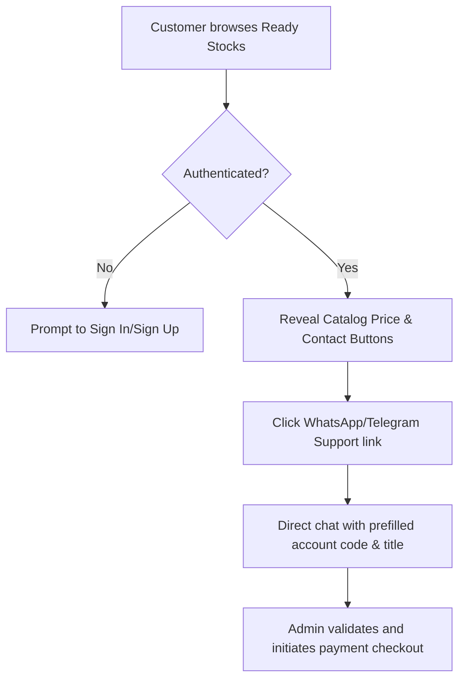
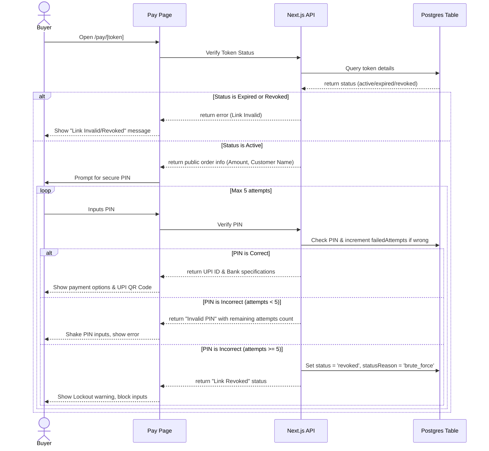

# Business Workflows: Operational Guide

This document describes the step-by-step business workflows of the Maddy BGMI Store.

---

## 1. Customer Buying Workflow

---

## 2. Customer Selling & Exchange Workflow

- **Timeline Selection**:
  - **Hold & Sell**: Account is audited, preview video recorded, and listed on VIP channels. Average sale: 3–7 days. Gives maximum market value (100% price).
  - **Instant Payout**: Wholesale buyout rate. Instant cash payout once login credentials are verified.
- **Handover Timeline Scenarios**:
  - **Scenario A (Multiple Logins)**: Account has dual active links (e.g. Facebook + Google Play). Requires a 7-15 days unlinking quarantine window to confirm detachment before payout release.
  - **Scenario B (Single Login)**: Account has only one active login link. Payout is released instantly (within 1-2 hours) after credential bindings are changed.
- **Escrow Handovers**:
  - Mutual escrow is coordinated via trusted gaming streamers or middleman dealers. The escrow agent holds the login during the audit and handles payout disbursement.

---

## 3. Admin Payment Link Creation Workflow

1. Admin opens `/admin/payment-links` (Requires `SUPER_ADMIN` or `TRANSACTION_MANAGER` role).
2. Admin inputs the customer's name, transaction note, amount, and generates or inputs a secure 4-6 digit checkout PIN.
3. Admin selects the active timer limit (from 5 to 30 minutes; defaults to 10 minutes).
4. System generates a secure token and creates a payload entry in the `payment_links` database table, returning the payment link: `https://pay.maddybgmistore.in/pay/[accessToken]`.
5. Admin copies the link and sends it to the buyer.

---

## 4. Payment Checkout & Lockout Workflow

---

## 5. Description Factory Workflow

1. Admin receives raw specifications text from an account owner or reseller.
2. Admin opens `/admin/desc-maker` and pastes the text into the parser.
3. The parser extracts the values (Level, Mythics count, ultimate sets, weapon upgrades, supercar count, login bindings, price, WhatsApp contact).
4. System calculates highlights (e.g. detecting high-tier combinations like double M416 upgrades).
5. Admins modify any parsed variables dynamically in input fields.
6. The factory renders a preview box simulating how the broadcast copy will format on WhatsApp and Telegram.
7. Admin clicks "Copy Text" to save the bolded, formatted payload (e.g., `*MBSx BGMI Store*`) and pastes it directly to VIP broadcast channels.
